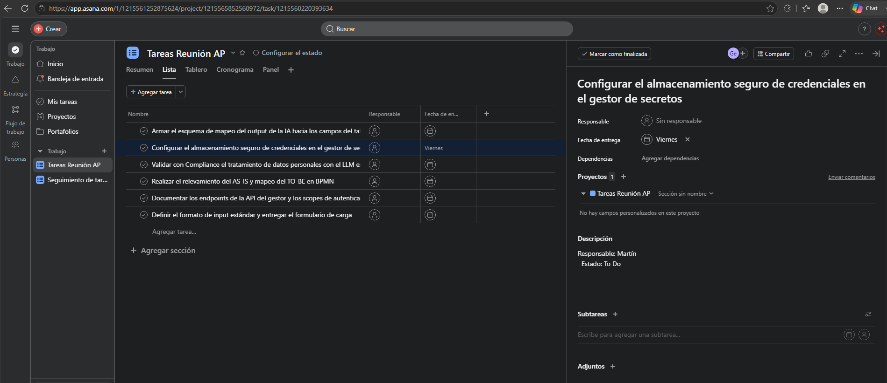
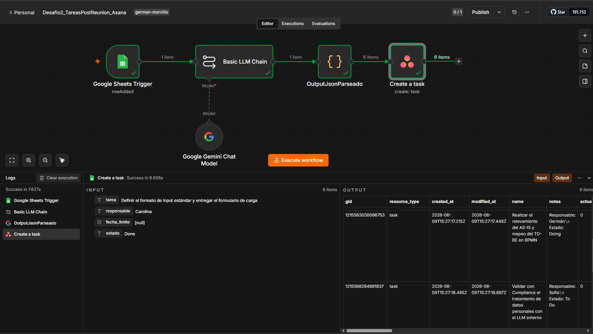

# 🚀 Tareas Post-Reunión — Asana (versión avanzada)


## Descripción

Versión avanzada del workflow de tareas post-reunión. Cualquier miembro del equipo completa un **Google Form** con la transcripción, y el flujo crea automáticamente las tareas en Asana con responsable, fecha límite y **estado de avance inferido por IA** (To Do / Doing / Done) a partir del lenguaje de la transcripción.

No requiere acceso a n8n: el punto de entrada es un formulario web accesible para cualquier persona.

> Este es el **Workflow 2** del proyecto [TareasPostReunionAI](../). Para la versión base con Manual Trigger y Trello, ver [TareasPostReunionTrello](../TareasPostReunionTrello/).

---

## Tabla de contenidos

1. [Demo](#demo)
2. [Arquitectura del flujo](#arquitectura-del-flujo)
3. [Pasos del flujo](#pasos-del-flujo)
4. [Conceptos clave](#conceptos-clave)
5. [Credenciales y variables](#credenciales-y-variables)
6. [Cómo importarlo](#cómo-importarlo)
7. [Estructura de archivos](#estructura-de-archivos)
8. [Lecciones aprendidas](#lecciones-aprendidas)

---

## Demo

**Video completo del flujo en acción:**

▶️ [Ver demo en Loom](https://www.loom.com/share/0e9dd5e1110144e6b9ef4393db0c0390)

**Resultado en Asana:**



**Vista del workflow en n8n:**



---

## Arquitectura del flujo

```
[Usuario] → Google Form
               ↓ (respuesta automática)
          Google Sheets
               ↓ (polling cada 1 min)
     Google Sheets Trigger (n8n)
               ↓
        Basic LLM Chain
        (Gemini 2.0 Flash)
               ↓
         Code: Parser JSON
         + Fan-out (1→N)
               ↓
       Asana: Create Task (×N)
```

**¿Por qué este diseño?** n8n no se conecta directamente a Google Forms. El puente Forms → Sheets es nativo de Google: cada respuesta del formulario cae como fila nueva en la hoja vinculada. n8n vigila esa hoja con polling y reacciona cuando aparece una fila nueva.

---

## Pasos del flujo

| # | Nodo | Tipo | Qué hace |
|---|------|------|----------|
| 1 | Google Sheets Trigger | Trigger (polling) | Detecta filas nuevas en la hoja de respuestas del formulario. Consulta cada 1 minuto. |
| 2 | Basic LLM Chain | AI / LLM | Envía la transcripción a Gemini 2.0 Flash. Extrae `tarea`, `responsable`, `fecha_limite` y `estado` (To Do / Doing / Done inferido del lenguaje). Recibe `$now` para calcular fechas relativas. |
| 3 | Code (Parser JSON) | Code | Limpia la respuesta del LLM y convierte el array de tareas en ítems separados de n8n (fan-out). |
| 4 | Asana: Create Task | Asana | Crea una tarea por ítem en el proyecto configurado. Nombre, notas (responsable + estado) y due_on. Se ejecuta N veces automáticamente. |

---

## Conceptos clave

### Google Forms como punto de entrada

El formulario tiene un único campo tipo **Párrafo** (`Transcripcion`) vinculado a un Google Sheet. Esto permite que cualquier persona del equipo dispare el flujo sin acceso a n8n.

```
Forms → Sheets → n8n (polling "Row Added")
```

### Polling vs Webhook vs Manual Trigger

| Tipo | Cuándo usarlo |
|------|---------------|
| **Manual Trigger** (Workflow 1) | Testeo y simulación. No es producción. |
| **Polling** (este workflow) | Reacción automática sin soporte de webhooks. Consulta cada X tiempo aunque no haya novedad. |
| **Webhook** | Notificación instantánea desde sistema externo. Más eficiente; requiere soporte del servicio. |

### Detección de estado por lenguaje natural

La IA infiere el estado de avance de cada tarea a partir del tiempo verbal:

| Estado | Señales en el texto |
|--------|-------------------|
| **To Do** | "va a hacer", "todavía no empezó", "tiene que", "aún no" |
| **Doing** | "está haciendo", "va por la mitad", "arrancó", "lo está terminando" |
| **Done** | "ya terminó", "entregó", "quedó cerrada" |

Esto es lo que diferencia este flujo de una automatización tradicional (RPA puro): el razonamiento sobre lenguaje natural.

### Notación de corchetes para campos con espacios

Si el campo en n8n tiene un espacio u otro carácter especial (frecuente con datos de Google Sheets), usar corchetes en vez de punto:

```javascript
// ❌ Falla si hay espacio al final del nombre
{{ $json.Transcripcion }}

// ✅ Funciona siempre
{{ $json["Transcripcion "] }}
```

### Manejo de `null` en Due On

Cuando `fecha_limite` es `null`, Asana crea la tarea **sin fecha de vencimiento, sin error**. Verificado: 6 tareas creadas, 5 con `due_on: null` → sin fecha, OK.

### Diferencias de nombres de campo: Asana vs Trello

| Campo | Trello | Asana |
|-------|--------|-------|
| Descripción | `Description` | `Notes` |
| Fecha límite | `Due Date` | `Due On` |
| Responsable nativo | Miembro (por ID) | Assignee (GID de usuario) |

> **Nota sobre Assignee:** el campo nativo de Asana requiere el GID de un usuario registrado en el workspace, no un texto libre. En este flujo el responsable se incluye en el campo `Notes`. Para asignación real, mapear nombres a GIDs de usuario de Asana.

---

## Credenciales y variables

| Variable / Credencial | Descripción | Referencia |
|-----------------------|-------------|------------|
| Google Sheets OAuth2 | Acceso a la hoja de respuestas del formulario | Credencial Google en n8n |
| Google Gemini API Key | Clave de API para Gemini 2.0 Flash | [Google AI Studio](https://aistudio.google.com/) |
| Asana Personal Access Token | Token de acceso personal de Asana | [app.asana.com/0/my-apps](https://app.asana.com/0/my-apps) |
| Sheet ID | ID de la hoja `Respuestas_Transcripciones` | En la URL de Google Sheets |
| Workspace ID (Asana) | ID del espacio de trabajo | Visible en URL de Asana |
| Project ID (Asana) | ID del proyecto destino | Visible en URL del proyecto |

---

## Cómo importarlo

### Prerequisitos

- n8n instalado (self-hosted o cloud).
- Cuenta de Google con Google Sheets OAuth2 configurado en n8n.
- API Key de Gemini activa.
- Cuenta de Asana con Personal Access Token generado.
- Google Form creado con un campo `Transcripcion` (tipo Párrafo), vinculado a un Google Sheet.

### Pasos

1. **Crear el formulario:** en [Google Forms](https://forms.google.com), creá un formulario con un campo tipo Párrafo llamado `Transcripcion`. En la pestaña **Respuestas**, vinculalo a una hoja nueva (`Respuestas_Transcripciones`).

2. **Importar el workflow:** en n8n → **Settings → Import from File** → elegí [`workflows/Desafio2_TareasPostReunion_Asana.json`](workflows/Desafio2_TareasPostReunion_Asana.json).

3. **Configurar credenciales:** Google Sheets OAuth2, Google Gemini API y Asana Personal Access Token.

4. **Actualizar el nodo Sheets Trigger:** seleccioná tu hoja `Respuestas_Transcripciones` y la pestaña `Respuestas de formulario 1`.

5. **Actualizar el nodo Asana:** seleccioná tu workspace y proyecto `Tareas Reunión AP`.

6. **Activar el workflow** (toggle en la esquina superior derecha de n8n).

7. **Probar:** llenás el formulario con una transcripción y en menos de 1 minuto aparecen las tareas en Asana.

### Prompt de referencia

Ver [`assets/Prompt.txt`](assets/Prompt.txt) para el prompt completo del Basic LLM Chain.

### Código del parser

Ver [`assets/parsearcodigo.js`](assets/parsearcodigo.js) para el código del Code node con comentarios explicativos.

---

## Estructura de archivos

```
TareasPostReunionAsana/
├── assets/
│   ├── Asana_OUTPUT.png                        # Captura del resultado en Asana
│   ├── Link video Desafio2_TareasPostReunion_Asana.url  # Link al video demo
│   ├── Prompt.txt                              # Prompt completo del LLM Chain
│   └── parsearcodigo.js                        # Código del Code node comentado
├── workflows/
│   ├── Desafio2_TareasPostReunion_Asana.json   # Workflow exportado de n8n
│   └── Workflow.png                            # Vista del canvas en n8n
└── README.md
```

---

## Lecciones aprendidas

| # | Lección | Detalle |
|---|---------|---------|
| 1 | Forms no conecta directo a n8n | El puente es Forms → Sheets → Sheets Trigger |
| 2 | Polling = consulta periódica | Más simple que webhook pero consume recursos aunque no haya novedad |
| 3 | La IA infiere estado por lenguaje | Tiempo verbal → To Do / Doing / Done |
| 4 | Notación de corchetes para campos sucios | `$json["Campo "]` para nombres con espacios de Google Sheets |
| 5 | `null` en Due On no rompe Asana | Crea la tarea sin fecha, sin error |
| 6 | Assignee requiere GID de usuario real | No acepta texto libre; usar Notes para responsable como texto |
| 7 | Nombres de campo difieren entre gestores | Trello: Description/Due Date — Asana: Notes/Due On |
| 8 | Fan-out con `.map()` | Un ítem de entrada → N ítems de salida, sin bucles |

---

## Licencia

MIT — libre para usar, modificar y distribuir con atribución.
