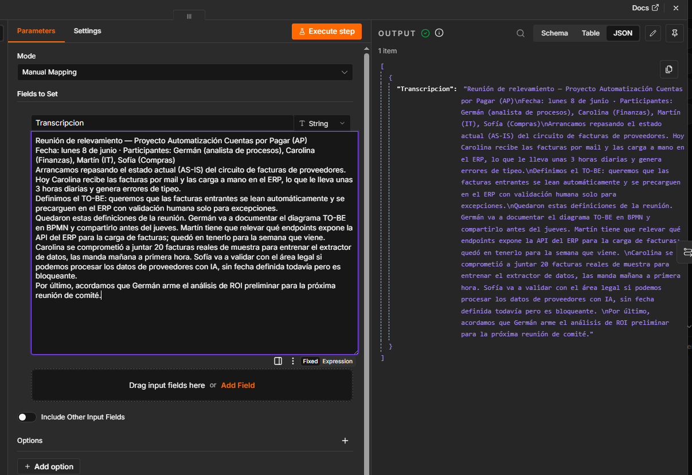
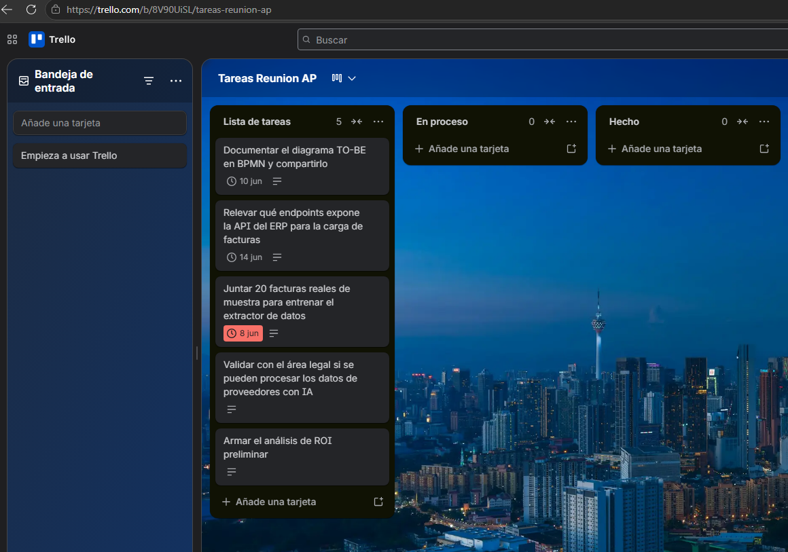
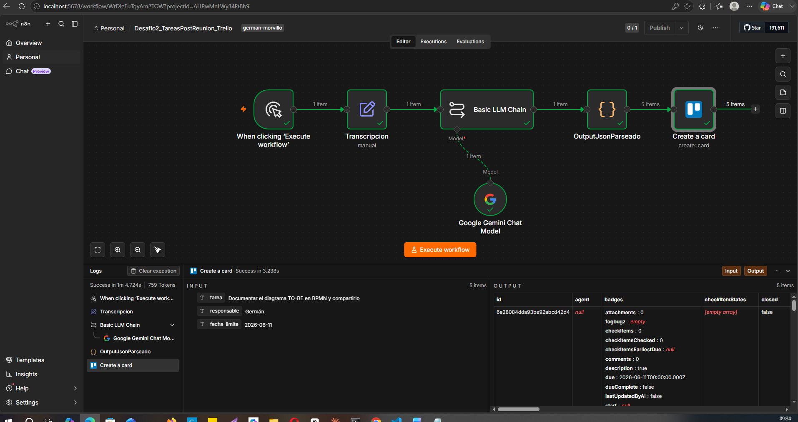

# 🗂️ Tareas Post-Reunión — Trello


## Descripción

Workflow base que toma el texto de una transcripción de reunión, usa IA (Gemini 2.0 Flash) para extraer los _action items_ con responsable y fecha límite, y crea automáticamente una tarjeta en Trello por cada tarea encontrada.

Elimina la carga manual de minutas (~20-30 min por reunión) y evita que tareas críticas queden sin registrar.

> Este es el **Workflow 1** del proyecto [TareasPostReunionAI](../). Para la versión avanzada con Google Forms + Asana + detección de estado, ver [TareasPostReunionAsana](../TareasPostReunionAsana/).

---

## Tabla de contenidos

1. [Demo](#demo)
2. [Pasos del flujo](#pasos-del-flujo)
3. [Conceptos clave](#conceptos-clave)
4. [Credenciales y variables](#credenciales-y-variables)
5. [Cómo importarlo](#cómo-importarlo)
6. [Estructura de archivos](#estructura-de-archivos)
7. [Lecciones aprendidas](#lecciones-aprendidas)

---

## Demo

**Transcripción de entrada (ejemplo representativo):**



**Resultado en Trello:**



**Vista del workflow en n8n:**



---

## Pasos del flujo

```
Manual Trigger → Edit Fields → Basic LLM Chain → Code (parser) → Trello: Create Card
```

| # | Nodo | Tipo | Qué hace |
|---|------|------|----------|
| 1 | Manual Trigger | Trigger | Dispara el flujo manualmente. Modo simulación/testeo. |
| 2 | Edit Fields | Set | Carga el texto de la transcripción como campo `transcripcion`. Separa origen de datos del procesamiento. |
| 3 | Basic LLM Chain | AI / LLM | Envía la transcripción a Gemini 2.0 Flash. Extrae `tarea`, `responsable` y `fecha_limite` en JSON. Recibe la fecha de hoy vía `$now` para calcular plazos relativos. |
| 4 | Code (Parser JSON) | Code | Limpia la respuesta del LLM (elimina markdown si lo envuelve) y convierte el string JSON en ítems separados de n8n (fan-out). |
| 5 | Trello: Create Card | Trello | Crea una tarjeta por cada ítem con título, descripción (responsable) y due date en ISO 8601. Se ejecuta N veces automáticamente por el fan-out. |

---

## Conceptos clave

### Fan-out (uno a muchos)

La transcripción entra como **un** ítem, pero salen **N** tareas separadas. En n8n los nodos procesan ítems de a uno automáticamente: si llegan N ítems, el nodo se ejecuta N veces. Por eso Trello crea N tarjetas sin ningún bucle.

Implementado en el Code node con:

```javascript
return tareas.map(t => ({ json: t }));
```

El formato `{ json: {...} }` es obligatorio para que n8n reconozca cada elemento como un ítem separado.

### Basic LLM Chain vs AI Agent

Para extraer JSON de un texto, **Basic LLM Chain** es la elección correcta. El AI Agent está pensado para razonamiento multi-paso con herramientas y memoria — es sobredimensionado para una llamada simple de texto-a-JSON. Ambos requieren un Chat Model conectado (el "cerebro").

### Fechas: ISO 8601 + `$now`

El LLM no sabe qué día es hoy. Para calcular fechas relativas ("antes del jueves"), se inyecta la fecha actual en el prompt:

```
FECHA DE HOY: {{ $now.format('yyyy-MM-dd') }}
```

Las fechas se piden en formato ISO 8601 (`YYYY-MM-DD`) para que la API de Trello las interprete sin ambigüedad.

### Manejo de `null` en Due Date

Cuando `fecha_limite` es `null`, Trello crea la tarjeta **sin fecha de vencimiento, sin error**. Verificado con evidencia real: 5 tarjetas creadas, 2 con `due: null` → sin fecha, OK. No se necesita un IF previo.

---

## Credenciales y variables

| Variable / Credencial | Descripción | Referencia |
|-----------------------|-------------|------------|
| Google Gemini API Key | Clave de API para Gemini 2.0 Flash | [Google AI Studio](https://aistudio.google.com/) |
| Trello API Key | Clave de la app en Trello Power-Ups | [trello.com/power-ups/admin](https://trello.com/power-ups/admin) |
| Trello API Token | Token de autorización de usuario | Generado desde la misma pantalla |
| List ID (Trello) | ID de la lista destino en el tablero | Ver método en notas abajo |

> **Cómo obtener el List ID de Trello:** navegá a `https://trello.com/b/<BOARD_ID>.json` y buscá con Ctrl+F el `"name"` de tu lista. El `"id"` que aparece justo antes es el que necesitás.

---

## Cómo importarlo

### Prerequisitos

- n8n instalado (self-hosted o cloud).
- Cuenta de Google con API Key de Gemini activa.
- Cuenta de Trello con API Key y Token generados.
- Un tablero de Trello con al menos una lista creada.

### Pasos

1. En n8n: **Settings → Import from File** → elegí [`workflows/Desafio2_TareasPostReunion_Trello.json`](workflows/Desafio2_TareasPostReunion_Trello.json).
2. Configurá las credenciales: Google Gemini y Trello API.
3. En el nodo **Edit Fields**, reemplazá el texto del campo `transcripcion` con tu propia transcripción.
4. En el nodo **Trello: Create Card**, actualizá el campo **List ID** con el ID de tu lista.
5. Ejecutá el workflow con el botón **Test workflow**.

### Prompt de referencia

El prompt completo del Basic LLM Chain está disponible en [`assets/Prompt.txt`](../TareasPostReunionAsana/assets/Prompt.txt) (versión extendida con el campo `estado`).

---

## Estructura de archivos

```
TareasPostReunionTrello/
├── assets/
│   ├── Ejemplo_Transcripcion.png     # Captura de la transcripción de entrada
│   ├── Trello_ListaTareas_IA.png     # Captura del resultado en Trello
│   └── codenode.json.js              # Código del Code node comentado
├── workflows/
│   ├── Desafio2_TareasPostReunion_Trello.json  # Workflow exportado de n8n
│   └── Workflow.png                  # Vista del canvas en n8n
└── README.md
```

---

## Lecciones aprendidas

| # | Lección | Detalle |
|---|---------|---------|
| 1 | Basic LLM Chain > AI Agent para llamadas simples | El Agent es sobredimensionado para texto-a-JSON |
| 2 | Siempre ISO 8601 para fechas | Evita que `11/06` se lea como noviembre |
| 3 | Inyectar `$now` en el prompt | El LLM no sabe la fecha de hoy |
| 4 | Fan-out con `.map()` | Un ítem de entrada → N ítems de salida |
| 5 | Limpieza defensiva de markdown | El LLM puede envolver el JSON en ` ```json ``` ` aunque se le pida que no |
| 6 | `null` en Due Date no rompe Trello | Crea la tarjeta sin fecha, sin error |
| 7 | Manual Trigger = modo simulación | No es para producción; para trigger real usar Polling o Webhook |

---

## Licencia

MIT — libre para usar, modificar y distribuir con atribución.
