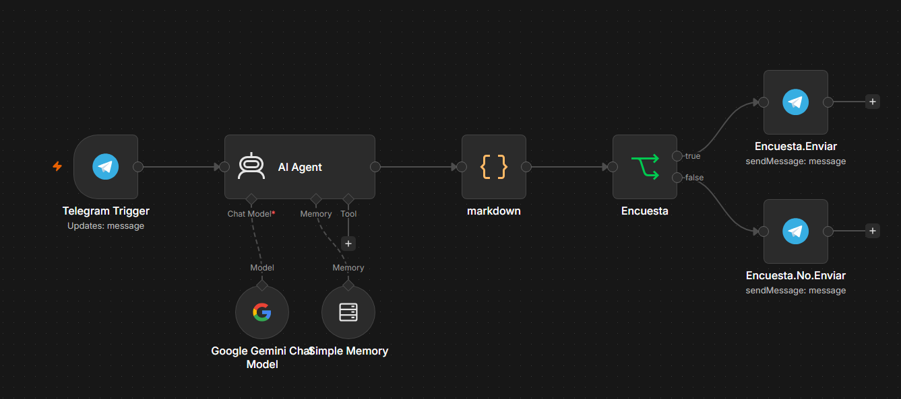
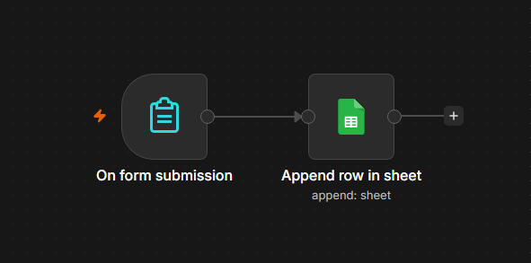
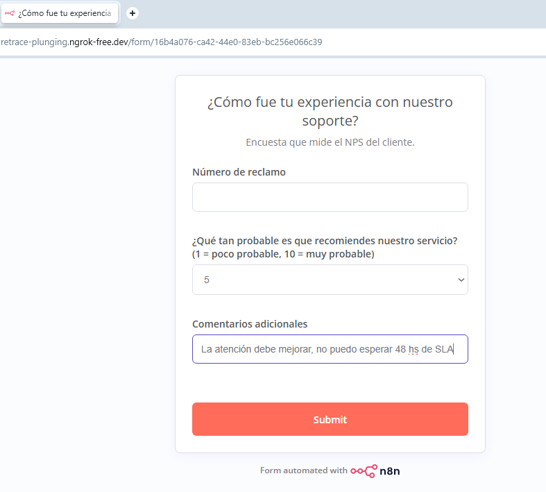
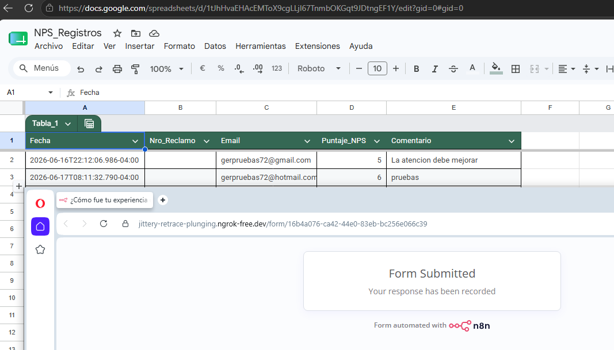
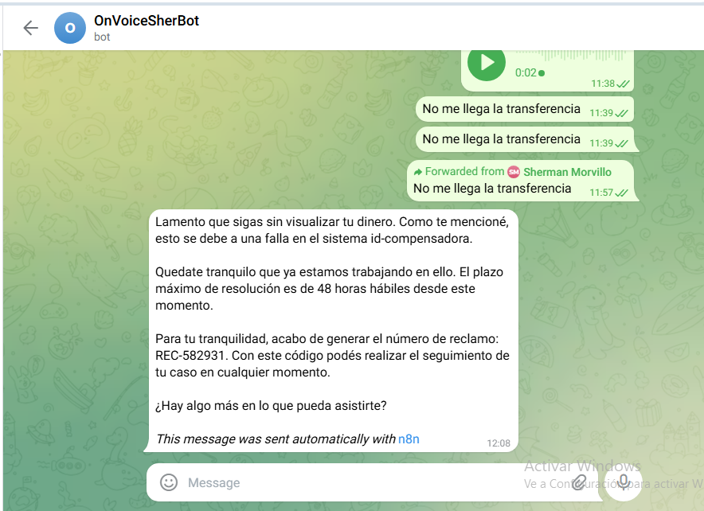
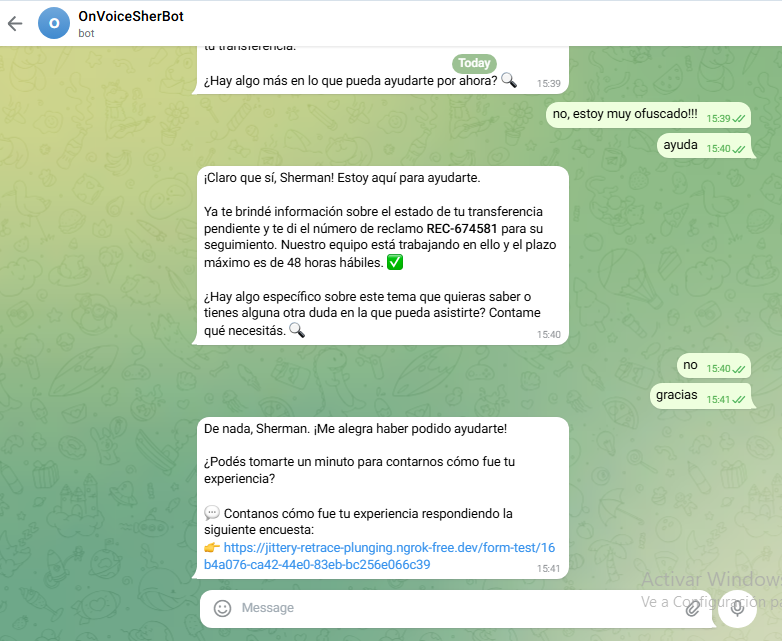
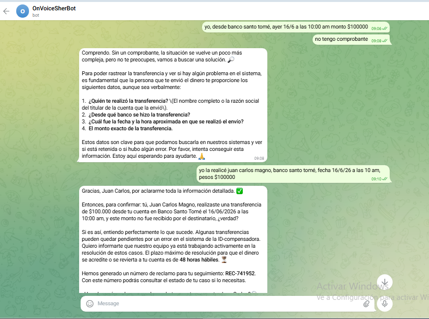
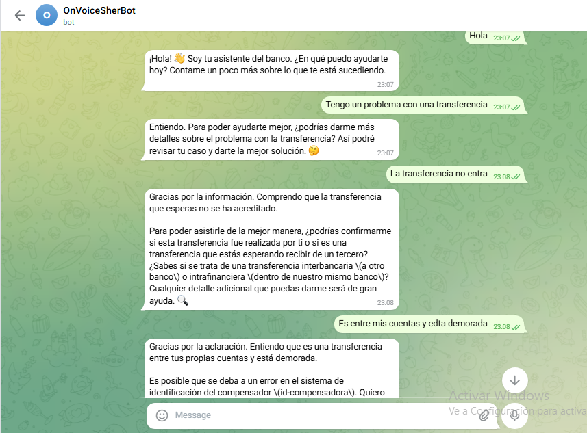

# 🤖 CSAT Telegram Chatbot — Bot de Atención + Encuesta NPS

   

Bot de atención al cliente con IA integrado en Telegram que simula el ciclo completo de soporte de una entidad financiera: recibe el reclamo del cliente, lo asiste con empatía, genera un número de caso, y al cerrar la conversación le envía automáticamente un link de encuesta NPS. Las respuestas se registran en tiempo real en Google Sheets.

---

## Tabla de contenidos

- [Vista del proceso](#vista-del-proceso)
- [Descripción del proyecto](#descripción-del-proyecto)
- [Arquitectura](#arquitectura)
- [Prerrequisitos](#prerrequisitos)
- [Instalación](#instalación)
- [Workflows](#workflows)
  - [Workflow 1: Bot de atención](#workflow-1-bot-de-atención-csat-telegram-chatbot)
  - [Workflow 2: Encuesta NPS](#workflow-2-encuesta-nps-encuesta-csat)
- [Galería](#galería)
- [Estructura del repositorio](#estructura-del-repositorio)
- [Learnings clave](#learnings-clave)
- [Limitaciones y próximos pasos (v2)](#limitaciones-y-próximos-pasos-v2)
- [Licencia](#licencia)

---

## Vista del proceso


> Diagrama con swimlanes generado desde el workflow de n8n. Editable en [draw.io](assets/BPMN%20Process.drawio.xml).

---

## Descripción del proyecto

Este proyecto es un ejemplo representativo de automatización aplicada a la atención al cliente en el sector financiero. Implementa dos workflows encadenados en n8n que replican, con herramientas gratuitas y open source, el mismo flujo que usan plataformas como Mercado Pago, Uala o cualquier fintech con soporte conversacional:

1. El cliente escribe al bot de Telegram con un problema (en este caso, una transferencia pendiente).
2. Un AI Agent con memoria mantiene una conversación empática, informa el estado del caso, genera un número de reclamo (`REC-XXXXXX`) y comunica el SLA de resolución (48 horas hábiles).
3. Al cerrar la conversación, el bot envía automáticamente el link de una encuesta NPS.
4. El cliente completa la encuesta y el puntaje queda registrado en Google Sheets con fecha, email, número de reclamo y comentarios.

**Problema que resuelve:** La atención manual de reclamos repetitivos (como demoras en transferencias) consume tiempo de agentes humanos y tiene alta variabilidad en calidad. Este bot estandariza la respuesta, registra el feedback y libera al equipo humano para casos complejos.

---

## Arquitectura

```
Cliente (Telegram)
        │
        ▼
┌─────────────────────────────────────────┐
│         Workflow 1: Bot de atención      │
│                                          │
│  Telegram Trigger                        │
│       → AI Agent (Gemini 2.5 Flash)      │
│         + Simple Memory (por chat.id)    │
│       → Code: limpieza Markdown          │
│       → IF: ¿contiene [ENCUESTA]?        │
│         ├── TRUE → Telegram: respuesta   │
│         │          + link encuesta NPS   │
│         └── FALSE → Telegram: respuesta  │
└─────────────────────────────────────────┘
        │ (cliente hace clic en el link)
        ▼
┌─────────────────────────────────────────┐
│       Workflow 2: Encuesta NPS           │
│                                          │
│  Form Trigger (n8n Form)                 │
│       → Google Sheets: Append Row        │
│         (Fecha, REC-, Email,             │
│          Puntaje NPS, Comentarios)       │
└─────────────────────────────────────────┘
```

---

## Prerrequisitos

| Herramienta | Versión mínima | Para qué |
|---|---|---|
| n8n (self-hosted) | 2.20+ | Motor de automatización |
| ngrok | cualquiera | Exponer localhost con HTTPS (necesario para webhooks) |
| Google Cloud Console | — | Credenciales de Gemini y Service Account para Sheets |
| Cuenta de Telegram | — | Crear el bot con BotFather |
| Google Sheets | — | Registro de respuestas NPS |

---

## Instalación

### 1. Clonar el repositorio

```bash
git clone https://github.com/sher414/Process.git
cd Process/N8N-Automatizaciones/Automatizaciones/Telegram-CSAT-ChatBOT
```

### 2. Iniciar n8n con ngrok

```powershell
# PowerShell
$env:WEBHOOK_URL="https://<tu-subdominio>.ngrok-free.app"
n8n start
```

O con el archivo `.bat` de arranque si lo tenés configurado.

### 3. Importar los workflows

En n8n: **Settings → Import from File** y cargá los dos JSON:

- `workflows/CSAT-TELEGRAM-CHATBOT.json`
- `workflows/Encuesta-CSAT.json`

### 4. Configurar credenciales

| Credencial | Tipo | Dónde se usa |
|---|---|---|
| Telegram Bot Token | Telegram API | Nodos Telegram Trigger, Encuesta.Enviar, Encuesta.No.Enviar |
| Google Gemini API Key | Google PaLM API | Nodo Google Gemini Chat Model |
| Google Service Account | Google Service Account API | Nodo Google Sheets (Append Row) |

> **Nota sobre Google Sheets:** se optó por autenticación vía **Service Account** en lugar de OAuth2 para eliminar la dependencia del flujo de consentimiento humano y la URL de callback, apropiado para un proceso desatendido (server-to-server). Ver sección [Learnings clave](#learnings-clave).

### 5. Compartir la planilla con la Service Account

En Google Sheets, compartí la planilla `NPS_Registros` con el email de la cuenta de servicio (`n8n-sheets@<tu-proyecto>.iam.gserviceaccount.com`) con rol **Editor**.

### 6. Activar los workflows

Activá ambos workflows con el toggle. El Workflow 2 (encuesta) debe estar activo para que la URL del formulario esté disponible.

---

## Workflows

### Workflow 1: Bot de atención (`CSAT-TELEGRAM-CHATBOT`)

**Qué resuelve:** atiende automáticamente reclamos de clientes en Telegram, mantiene el hilo de la conversación con memoria, genera un número de caso y deriva al cliente a una encuesta de satisfacción al cerrar.

**Valor:** elimina la intervención humana en reclamos de primer nivel (transferencias pendientes, errores del sistema), estandariza la respuesta con SLA comunicado y captura el NPS al cierre. Ejemplo representativo de un bot de soporte financiero con IA conversacional.

**Trigger:** webhook de Telegram (evento `message`). Instantáneo, event-driven.



#### Pasos del flujo

| # | Nodo | Tipo | Qué hace |
|---|------|------|----------|
| 1 | Telegram Trigger | Webhook | Recibe cada mensaje del cliente en tiempo real |
| 2 | AI Agent | LangChain Agent | Procesa el mensaje con Gemini 2.5 Flash. Mantiene contexto con Simple Memory por `chat.id`. Sigue un System Prompt estructurado: saluda, escucha, informa el caso, genera `REC-XXXXXX`, ofrece ayuda y cierra proactivamente |
| 3 | Google Gemini Chat Model | LLM | Modelo de lenguaje conectado al AI Agent como "cerebro" |
| 4 | Simple Memory | Buffer Memory | Guarda el historial de la conversación con clave `chat.id`. Permite que el agente recuerde mensajes anteriores dentro de la misma sesión |
| 5 | markdown | Code (JS) | Limpia el texto generado por Gemini: convierte `**negrita**` a `*negrita*`, elimina links Markdown y escapa caracteres reservados de Telegram. Preserva `[ENCUESTA]` para el nodo siguiente |
| 6 | Encuesta | IF | Detecta si el output contiene `[ENCUESTA]`. Si el agente cerró el caso → rama TRUE. Si la conversación sigue → rama FALSE |
| 7 | Encuesta.Enviar | Telegram | (Rama TRUE) Envía la respuesta del agente + el link del formulario NPS con el `REC-` embebido como parámetro URL (`?reclamo=REC-XXXXXX`) |
| 8 | Encuesta.No.Enviar | Telegram | (Rama FALSE) Envía solo la respuesta del agente sin link de encuesta |

#### System Prompt del AI Agent

```
Sos un agente de soporte de una entidad financiera muy reconocida.
Tu objetivo es atender al cliente con empatía, en español, de forma breve y clara.
Usá emojis de forma moderada y natural para transmitir calidez y cercanía.
El SLA máximo de resolución es de 48 horas hábiles desde que se registró el reclamo.

Seguí este orden en la conversación:
1. Saludá al cliente y preguntale cuál es su problema.
2. Escuchá su consulta y respondé según lo que te cuente.
3. Si menciona una transferencia pendiente por error en el sistema id-compensadora,
   informale que ya están trabajando en ello, que el SLA máximo es de 48 horas hábiles
   y generá un número de reclamo con el formato REC-XXXXXX.
4. Antes de cerrar, preguntale explícitamente: "¿Hay algo más en lo que pueda ayudarte?".
5. Si el cliente responde que no necesita más ayuda, cerrá INMEDIATAMENTE la conversación.
6. Al cerrar, terminá tu respuesta con exactamente esta línea, sin excepción:
   [ENCUESTA] ¿Podés tomarte un minuto para contarnos cómo fue tu experiencia?
```

#### Credenciales y variables

| Variable / Credencial | Descripción | Valor de ejemplo |
|---|---|---|
| Telegram API | Token del bot creado en BotFather | `<TU_TOKEN_DE_TELEGRAM>` |
| Google PaLM API | API Key de Google Gemini | `AIza...` |
| `WEBHOOK_URL` | URL pública de ngrok configurada al iniciar n8n | `https://<subdominio>.ngrok-free.app` |
| URL del formulario NPS | URL del Form Trigger del Workflow 2 (producción) | `https://<subdominio>.ngrok-free.app/form/<uuid>` |

#### Notas y limitaciones

- La **Simple Memory** es in-process: el historial se pierde si n8n se reinicia. Para producción, reemplazarla por `Postgres Chat Memory` o `Redis Chat Memory`.
- El número de reclamo (`REC-XXXXXX`) lo genera el LLM aleatoriamente. En producción debería venir de una base de datos con autoincremento.
- Telegram no permite dos webhooks activos simultáneamente para el mismo bot: al activar el workflow en producción, el modo test queda deshabilitado.

---

### Workflow 2: Encuesta NPS (`Encuesta-CSAT`)

**Qué resuelve:** captura el puntaje NPS del cliente después de su interacción con el bot y lo registra automáticamente en Google Sheets.

**Valor:** reemplaza el proceso manual de recolección de feedback por un formulario web activado automáticamente al cierre de cada caso. El puntaje queda disponible en tiempo real para análisis. Ejemplo representativo de captura de NPS con n8n + Google Sheets.

**Trigger:** Form Trigger de n8n (webhook). Se activa cuando el cliente envía el formulario.



#### Pasos del flujo

| # | Nodo | Tipo | Qué hace |
|---|------|------|----------|
| 1 | On form submission | Form Trigger | Expone un formulario web accesible vía URL. Recibe los campos del cliente al hacer Submit |
| 2 | Append row in sheet | Google Sheets | Agrega una fila nueva en `NPS_Registros` con los 5 campos mapeados |

#### Campos del formulario



| Campo | Tipo | Nota |
|---|---|---|
| Número de reclamo | Texto | Opcional — se pre-carga vía parámetro `?reclamo=` en la URL |
| Tu email de contacto | Email | Requerido |
| ¿Qué tan probable es que recomiendes nuestro servicio? | Dropdown (1-10) | Escala NPS estándar |
| Comentarios adicionales | Texto | Opcional |

#### Registro en Google Sheets



| Fecha | Nro_Reclamo | Email | Puntaje_NPS | Comentario |
|---|---|---|---|---|
| 2026-06-17T08:11:32 | REC-842109 | cliente@mail.com | 8 | Muy buena atención |

#### Credenciales y variables

| Variable / Credencial | Descripción | Valor de ejemplo |
|---|---|---|
| Google Service Account API | Cuenta de servicio con acceso a la planilla | `n8n-sheets@<proyecto>.iam.gserviceaccount.com` |
| ID planilla Google Sheets | ID de la planilla `NPS_Registros` | `1tJh...EF1Y` |

---

## Galería

| Conversación Telegram | Cierre con encuesta |
|---|---|
|  |  |

| Detalles del caso | Respuesta con REC- |
|---|---|
|  |  |

---

## Estructura del repositorio

```
Telegram-CSAT-ChatBOT/
├── workflows/
│   ├── CSAT-TELEGRAM-CHATBOT.json   # Workflow 1: bot de atención
│   └── Encuesta-CSAT.json           # Workflow 2: encuesta NPS
├── assets/
│   ├── BPMN Process.drawio.png      # Diagrama BPMN con swimlanes
│   ├── BPMN Process.drawio.xml      # Fuente editable en draw.io
│   ├── flow_1.png                   # Canvas del Workflow 1
│   ├── flow_2.png                   # Canvas del Workflow 2
│   ├── chat_telegram.png            # Conversación en Telegram (inicio)
│   ├── chat_telegram_1.png          # Conversación en Telegram (desarrollo)
│   ├── chat_telegram_2.png          # Conversación en Telegram (cierre con REC-)
│   ├── chat_telegram_encuesta.png   # Mensaje con link de encuesta
│   ├── Form_Encuesta.png            # Formulario NPS
│   └── Backend_sheet.png            # Google Sheets con registros
└── README.md
```

---

## Learnings clave

### 1. AI Agent vs Basic LLM Chain

Para conversaciones multi-turno con memoria, el nodo correcto es **AI Agent** (no Basic LLM Chain). El AI Agent soporta memoria entre mensajes y razonamiento contextual. El Basic LLM Chain es para transformaciones únicas (texto entrada → texto salida). Elegir el nodo adecuado es criterio de diseño, no preferencia.

### 2. Simple Memory: clave de sesión por `chat.id`

La Simple Memory de n8n necesita una clave de sesión para separar las conversaciones de distintos usuarios. La clave correcta para un bot de Telegram es `chat.id` (`{{ $('Telegram Trigger').item.json.message.chat.id }}`). Usando `sessionId` del Chat Trigger (el default) el nodo falla porque ese campo no existe en el contexto de Telegram.

### 3. Service Account vs OAuth2 para Google Sheets

Se optó por autenticación vía **Service Account** en lugar de OAuth2 para eliminar la dependencia del flujo de consentimiento humano y la URL de callback, apropiado para un proceso desatendido (server-to-server).

OAuth2 falla en entornos locales con ngrok porque:
- La URL de callback cambia si ngrok no tiene dominio estático (`redirect_uri_mismatch`).
- Si la app está en modo testing, bloquea usuarios no autorizados (`Error 403: access_denied`).

**Regla práctica:**
- OAuth2 → apps multi-usuario donde cada cliente conecta su propia cuenta de Google.
- Service Account → procesos automáticos que acceden siempre a los mismos recursos que vos controlás.

### 4. Limpieza de Markdown antes de enviar a Telegram

Gemini devuelve texto con formato Markdown. Telegram en modo `Markdown` es estricto con caracteres especiales y falla con `400 Bad Request: can't parse entities`. La solución es un nodo Code que limpia el texto antes de enviarlo, preservando `[ENCUESTA]` para el nodo IF.

### 5. Señal interna para bifurcar el flujo (`[ENCUESTA]`)

El AI Agent no puede llamar directamente al siguiente nodo. La técnica es que el LLM incluya una **señal interna** en su respuesta (`[ENCUESTA]`) que el nodo IF detecta. El nodo Code la preserva y el nodo `Encuesta.Enviar` la elimina antes de mandarla al cliente.

### 6. Parámetro URL para pre-cargar el número de reclamo

El `REC-XXXXXX` generado por el bot se extrae con regex (`$json.output.match(/REC-\d{6}/)?.[0] ?? ''`) y se pasa como parámetro en la URL del formulario (`?reclamo=REC-XXXXXX`). En el Workflow 2 se captura con `$json.query?.reclamo`. Elimina la necesidad de que el cliente copie y pegue el número manualmente.

---

## Limitaciones y próximos pasos (v2)

- [ ] **Mail de confirmación de reclamo** al cliente cuando el bot genera el `REC-`
- [ ] **Mail de resolución del caso** a las 48 horas hábiles
- [ ] **Mail de agradecimiento** al completar la encuesta
- [ ] **Campo oculto en el formulario** para pre-cargar el `REC-` sin que el cliente lo vea
- [ ] **Persistencia de memoria** con Redis o Postgres para sobrevivir reinicios de n8n
- [ ] **Número de reclamo desde base de datos** con autoincremento real
- [ ] **Dashboard de NPS** con Google Looker Studio conectado a la planilla

---

## Licencia

MIT — libre para usar, modificar y distribuir con atribución.

---

*Desarrollado por Germán Pablo Morvillo — [LinkedIn](https://www.linkedin.com/in/german-pablo-morvillo) · [GitHub](https://github.com/sher414)*
