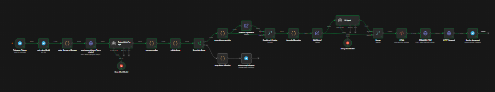
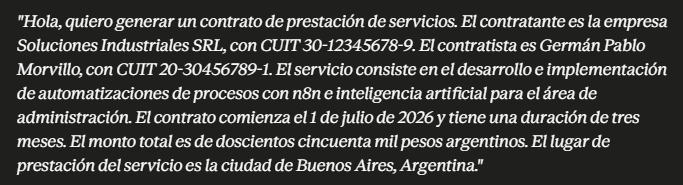
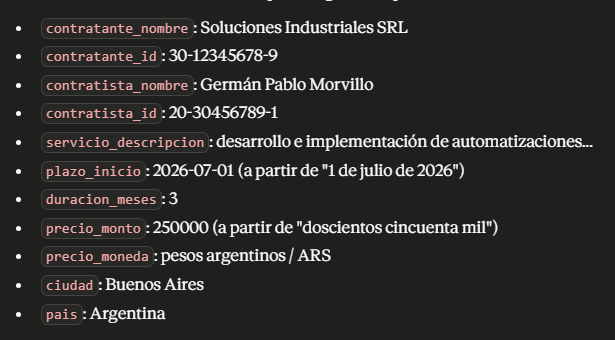
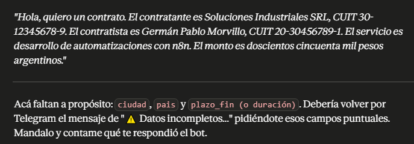
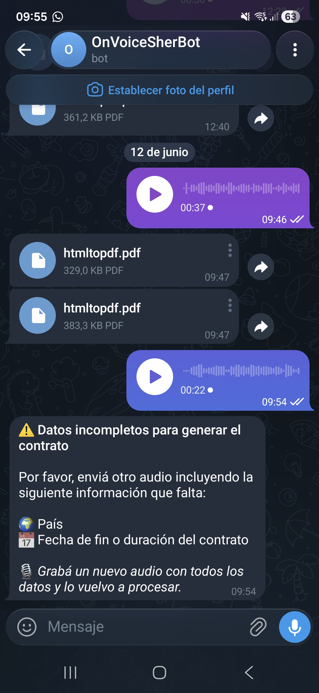

## Workflow: Generador de Contratos por Audio (TranscribirAudioTelegram)

**Qué resuelve:** un usuario manda un audio por Telegram contando los datos de un acuerdo de prestación de servicios, y el bot le devuelve un PDF con el contrato listo, redactado en lenguaje técnico-legal y con marco normativo argentino incluido.

**Valor:** elimina la redacción manual de un contrato de servicios (~30-45 min por documento, más el riesgo de omitir cláusulas legales obligatorias). El usuario solo dicta los datos clave por voz y recibe un PDF profesional en minutos. Ejemplo representativo de automatización end-to-end combinando voz → IA → documento, útil para freelancers, estudios contables o áreas de compras que generan contratos repetitivos.

**Trigger:** mensaje de voz recibido en un chat de Telegram.

### Pasos del flujo

| # | Nodo | Tipo | Qué hace |
|---|------|------|----------|
| 1 | Telegram Trigger | Telegram Trigger | Se activa cuando llega un mensaje al bot |
| 2 | get.voice.file.id | Telegram (resource: file) | Descarga el archivo de voz usando el `file_id` del mensaje |
| 3 | voice file.oga a file.ogg | Code | Renombra el binario descargado a `audio.ogg` (nombre, extensión y mimeType), porque Telegram entrega `.oga` y la API de transcripción espera `.ogg` |
| 4 | post.groq.whisper(Transcriptor) | HTTP Request | Envía el audio a la API de Groq (modelo `whisper-large-v3`) y obtiene el texto transcripto |
| 5 | Extract.Info.Prompt | AI Agent (Groq Chat Model) | Analiza la transcripción y devuelve un JSON con los datos del contrato (contratante, contratista, servicio, plazos, montos, ciudad, país) |
| 6 | parsear.codigo | Code | Limpia el JSON que devuelve el modelo (sacando los \`\`\`json y cualquier texto extra) y lo mapea a un objeto plano |
| 7 | validardatos | Code | Valida que estén los campos obligatorios, normaliza el monto (separadores de miles/decimales) y arma un objeto `{ ok, faltantes, datos }` |
| 8 | if.con/sin.datos | IF | Si `ok = false` (faltan datos) va por la rama de "faltantes"; si `ok = true` sigue por la rama de "completo" |
| 9a | msg.datos.faltantes | Code | (Rama "faltan datos") Construye un mensaje amigable listando qué información falta |
| 10a | return.msg.telegram | Telegram | Envía ese mensaje al chat, pidiendo un nuevo audio con los datos faltantes |
| 9b | msg.datos.completo | Code | (Rama "datos OK") Calcula fechas de inicio/fin del contrato a partir de la duración informada y normaliza formato ISO 8601 |
| 10b | Normas Argentinas | Set | Carga un array fijo con normativa argentina relevante (Ley de Datos Personales, Firma Digital, Código Civil y Comercial, Monotributo, jurisdicción, etc.) |
| 11 | Combina.2.Nodos | Merge (combine by position) | Junta en un mismo item los datos del contrato (paso 9b) con el array de normativas (paso 10b) |
| 12 | Armado Clausulas | Code | Con las normativas, redacta los textos de "Marco Jurídico de Referencia" y "Validez de la Firma Digital" como cláusulas listas para insertar en el contrato |
| 13 | Edit Fields1 | Set | Deja un objeto plano y prolijo con todos los campos finales del contrato (partes, montos, fechas, cláusulas) |
| 14 | AI Agent | AI Agent (Groq Chat Model1) | Toma ese objeto y redacta el contrato completo en HTML, con estructura jurídica formal (comparecencia, objeto, vigencia, precio, confidencialidad, normativa, firma) |
| 15 | Merge | Merge | Combina los datos de Edit Fields1 con el HTML generado por el AI Agent |
| 16 | HTML | HTML | Inserta el contenido generado dentro de una plantilla HTML con estilos (tipografía, colores, layout tipo documento A4) |
| 17 | CREACIÓN PDF1 | HTTP Request (pdf.co) | Convierte el HTML final a PDF vía la API de pdf.co |
| 18 | HTTP Request | HTTP Request | Descarga el PDF generado desde la URL que devuelve pdf.co |
| 19 | Send a document | Telegram (sendDocument) | Envía el PDF al usuario por el mismo chat de Telegram |

#### Ejemplo: audio de entrada (caso completo)

#### Ejemplo: datos extraídos por la IA (salida de Extract.Info.Prompt / parsear.codigo)

### Credenciales y variables

| Variable / Credencial | Descripción | Valor de ejemplo |
|------------------------|-------------|-------------------|
| Telegram account (Telegram API) | Token del bot usado para recibir mensajes, descargar el audio y responder | `<TU_TOKEN_DE_TELEGRAM>` |
| Groq account (credencial LangChain) | Acceso al Chat Model de Groq usado por los dos AI Agent | `<TU_GROQ_API_KEY>` |
| ApiKey_groq (Header Auth) | Header `Authorization` para llamar a la API de transcripción Whisper de Groq | `Bearer <TU_GROQ_API_KEY>` |
| pdf.co API Key (Header Auth) | Header `x-api-key` para convertir el HTML a PDF | `<TU_PDFCO_API_KEY>` |

> ⚠️ La API key de pdf.co venía hardcodeada como texto plano dentro del nodo "CREACIÓN PDF1". Se recomienda regenerarla en pdf.co y configurarla como credencial de tipo Header Auth, igual que se hizo con la de Groq.

### Cómo importarlo

1. En n8n: **Import from File** y elegí el JSON `TranscribirAudioTelegram.json`.
2. Configurá las 4 credenciales listadas arriba en **Credentials**.
3. Activá el workflow y agregá el bot de Telegram al chat de prueba.
4. Probalo enviando un audio donde menciones: nombre y datos de ambas partes, descripción del servicio, plazos (o duración), monto, moneda, ciudad y país.

### Resultado final: PDF generado

Este es el contrato final que el bot devuelve por Telegram, generado a partir del audio de ejemplo de la sección anterior:

📄 [Ver contrato generado (PDF)](./assets/contrato-generado-ejemplo.pdf)

El documento incluye comparecencia de las partes, objeto del servicio, vigencia, cronograma de pagos por hitos, obligaciones, cláusula de confidencialidad, marco normativo argentino completo (con fuentes) y el bloque de validación de firma digital — todo redactado automáticamente por el AI Agent a partir de los datos extraídos del audio.

### Caso: datos incompletos (rama "if.con/sin.datos" → falso)

Para probar la rama de validación, se envió un audio omitiendo a propósito la ciudad, el país y la fecha de fin/duración del contrato:

El nodo `validardatos` detecta los campos faltantes (`pais`, `plazo_fin / duración`) y, en vez de avanzar hacia la generación del PDF, el flujo responde por Telegram pidiendo un nuevo audio con la información que falta:

Esto evita generar contratos con campos vacíos o `null` en cláusulas legales clave.

### Aprendizajes de la implementación

- **Nunca dejar API keys hardcodeadas en los nodos HTTP Request.** El export original tenía la key de pdf.co en texto plano dentro de un Header Parameter. Se migró a una credencial de tipo **Header Auth** (`x-api-key`), siguiendo el mismo patrón ya usado para la API de Groq. Esto evita que la key quede expuesta si el JSON del workflow se sube a un repo o se comparte.

### Notas y limitaciones

- **Precisión de nombres propios:** en la prueba realizada, el pipeline transcripción + AI Agent introdujo errores menores en nombres propios ("Soluciones Industriales SRL" → "Soluciones Integrales SRL", "Morvillo" → "Morbillo"). Para uso real se recomienda agregar un paso de revisión humana antes de firmar, o un diccionario de nombres conocidos para corrección posterior.
- **Fuga de CSS en el documento final:** en algunos casos el bloque `<style>` generado por el AI Agent para la sección de firma no cierra correctamente, y el código CSS aparece como texto visible en el PDF. Se recomienda sanitizar/validar el HTML antes de convertirlo a PDF (por ejemplo, con una expresión regular que cierre tags `<style>` abiertos o un validador HTML).

- Si falta algún dato obligatorio, el bot responde pidiendo un nuevo audio en lugar de generar el contrato (no acumula información de audios anteriores).
- La redacción legal la genera un modelo de IA: sirve como borrador, **no reemplaza la revisión de un profesional** antes de firmar.
- El array de "Normas Argentinas" está fijo en el flujo (no se busca en tiempo real); si cambia la legislación hay que actualizarlo manualmente.
- Depende de dos servicios externos (Groq y pdf.co); si alguno está caído o sin cuota, el flujo se interrumpe sin reintentos automáticos.
