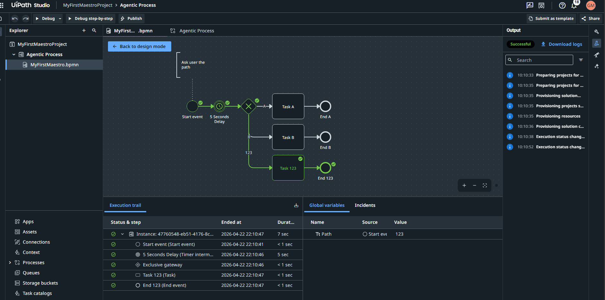
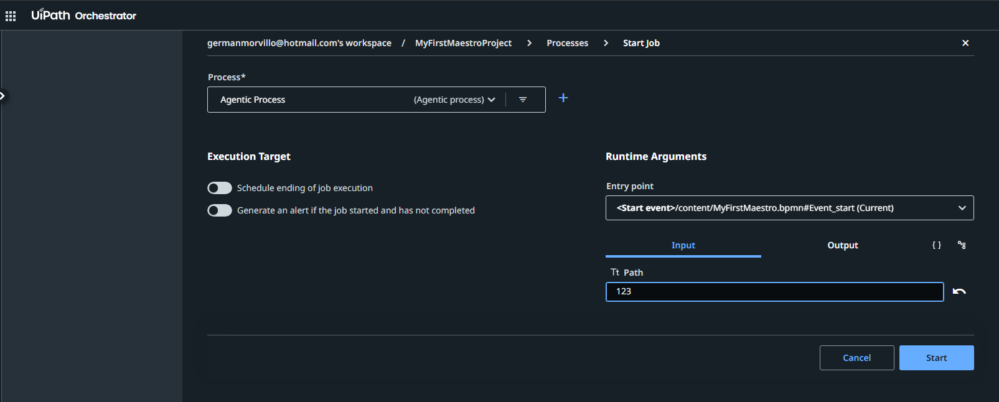
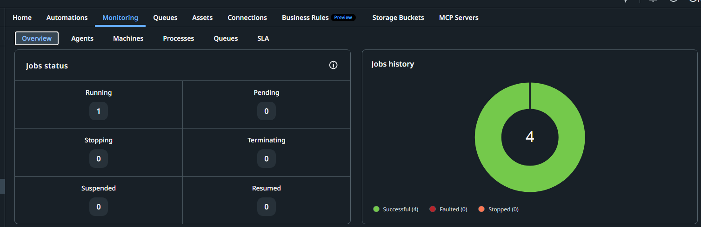
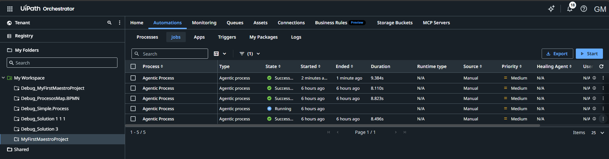

🧩 Contenido del Repositorio
📂 BPMN — Introduction to BPMN Concepts
Incluye diagramas, conceptos fundamentales y ejemplos prácticos de modelado de procesos:

Diagramas BPMN básicos e intermedios

Eventos, compuertas, flujos y actividades

Ejemplos de procesos reales modelados

Buenas prácticas de documentación

📂 UiPath — Process Examples
Ejemplos de automatizaciones desarrolladas en UiPath Studio:

Flujos en XAML

Secuencias y workflows reutilizables

Ejercicios de automatización

Casos de uso aplicados a procesos modelados en BPMN

📂 Power Automate — Archivos_PA
Automatizaciones low-code:

Flujos automatizados

Ejemplos de integración

Casos de uso simples y avanzados

🛠️ Tecnologías Utilizadas
BPMN 2.0

UiPath Studio / UiPath Platform

Power Automate Desktop & Cloud

Process Documentation & Analysis

🧠 Habilidades Demostradas
Modelado de procesos con BPMN

Diseño de automatizaciones end-to-end

Documentación técnica clara y profesional

Análisis funcional y optimización de procesos

Integración de herramientas RPA y low-code

Buenas prácticas de versionado y repositorios Git

📌 Caso Práctico (Recomendado para ampliar)
Automatización completa: desde BPMN hasta UiPath  
Podés agregar un caso práctico que incluya:

Diagrama BPMN

Explicación del proceso

Automatización en UiPath

Capturas del flujo

Resultado final

Esto eleva muchísimo el valor del portfolio.

👤 Autor
Germán  
Industrial Engineer · Digital Transformation · Process Automation
Especialista en BPMN, UiPath, Power Automate y optimización de procesos.

Agentic Process — End‑to‑End Guide (BPMN → Orchestrator → Jobs → Monitoring)
UiPath Maestro · BPMN · Orchestrator · Monitoring
📑 Índice
Modelado del Agentic Process en BPMN

Publicación del proceso en Orchestrator

Iniciar un Job con Inputs

Verificar ejecuciones en Job History (Monitoring)

Analítica de Process Instances

1️⃣ Modelado del Agentic Process en BPMN
Este es el diseño del proceso en UiPath Maestro, con un Start Event, un Timer, un Exclusive Gateway y tres ramas posibles según el input recibido.

📸 Diagrama BPMN
markdown

En este ejemplo, la variable global Path determina qué rama toma el proceso:

"A" → Task A

"B" → Task B

"123" → Task 123

Durante la ejecución, el valor de la variable se ve reflejado en el panel de Global Variables.

📸 Ejecución del BPMN con variable Path
markdown

2️⃣ Publicación del proceso en Orchestrator
Una vez validado el BPMN, se publica desde Maestro y aparece en Orchestrator como un Agentic Process.

📸 Ventana de Start Job con Entry Point e Input
markdown

Aquí se define:

Entry Point (Start Event del BPMN)

Inputs (ej: Path = "123")

Execution Identity si corresponde

3️⃣ Iniciar un Job con Inputs
Desde Automations → Jobs, se puede iniciar una ejecución manual del proceso.

📸 Lista de Jobs ejecutados
markdown

Cada ejecución muestra:

Estado (Running, Success, Faulted)

Duración

Usuario

Prioridad

Tipo de runtime

4️⃣ Verificar ejecuciones en Job History (Monitoring)
El panel de Monitoring permite ver el estado general de los procesos ejecutados.

📸 Dashboard de Monitoring
markdown

Incluye:

Jobs Running

Jobs Successful

Faulted

Stopped

Gráficos de distribución

5️⃣ Analítica de Process Instances
UiPath Maestro también ofrece un panel de analítica para ver:

Procesos más ejecutados

Duración total

Cantidad de completados vs fallados

Versiones del proceso

📸 Panel de Process Instances
markdown

Este panel es clave para:

Auditoría

Optimización

Identificación de fallas

Métricas de rendimiento
